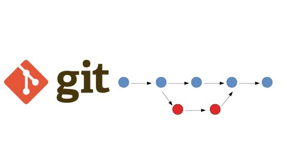

<<<<<<< HEAD
# Инструкция по работе с GIT

# Базовые команды

*git init* – **инициализация локального репозитория**

*git status* – **получить информацию от git о его текущем состоянии**

*git add* – **добавить файл или файлы к следующему коммиту**

*git commit -m “message”* – **создание коммита.**

<<<<<<< HEAD
*git log* – **вывод на экран истории всех коммитов с их хеш-кодами**

## Команды для ветвления 

*git branch* -**команда для вывода всех веток на экран**
 
 *git branch <branch_name>* - **создание новой ветки**

 *gti checkout <brznch_name>* - **Переход на другую ветку**
 
 *git merge <branch-name>* - **Слияние веток между собой**

*git branch -d <branch_name>* - **Удаление уже слитой ветки**

*git log --graph*  - **Вывод журнала изменений с визуализацией**

---

### Заметки

для перехода от ветки к ветке необходимо возвращаться к родительской ветке:
* __Правильно:__  
    *master -> seminar_1 - >master -> seminar_2*
* __Неправильно:__  
     *master -> seminar_1 -> seminar_2*

***
=======
>>>>>>> parent of 045ab35 (add commands for work with branches)
=======
*git log* – **вывод на экран истории всех коммитов с их хеш-кодами**
>>>>>>> parent of 6f85a96 (add some remarks and links within the document)
